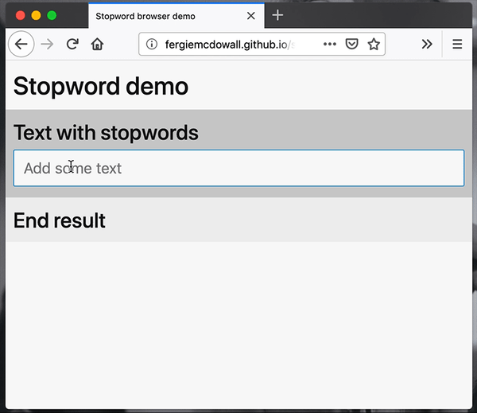

# stopword
`stopword` is a module for node and the browser that allows you to strip
stopwords from an input text. [In natural language processing, "Stopwords" are
words that are so frequent that they can safely be removed from a text without
altering its meaning.](https://en.wikipedia.org/wiki/Stop_words)

[![NPM version][npm-version-image]][npm-url]
[![NPM downloads][npm-downloads-image]][npm-url]
[![MIT License][license-image]][license-url]
[![Build Status][travis-image]][travis-url]



Live [stopword browser demo](http://fergiemcdowall.github.io/stopword/demo/).

## Usage

### Node.js
```javascript
sw = require('stopword')
// sw.removeStopwords and sw.[language code] now available
```

### Script tag method
```html
<script src="stopword.js"></script>

<script>
// sw.removeStopwords and sw.[language code] now available
</script>
```


### Default (English)
By default, `stopword` will strip an array of "meaningless" English words

```javascript
sw = require('stopword')
const oldString = 'a really Interesting string with some words'.split(' ')
const newString = sw.removeStopwords(oldString)
// newString is now [ 'really', 'Interesting', 'string', 'words' ]

```

### Other languages
You can also specify a language other than English:
```javascript
sw = require('stopword')
const oldString = 'Trädgårdsägare är beredda att pröva vad som helst för att bli av med de hatade mördarsniglarna åäö'.split(' ')
// sw.sv contains swedish stopwords
const newString = sw.removeStopwords(oldString, sw.sv)
// newString is now [ 'Trädgårdsägare', 'beredda', 'pröva', 'helst', 'hatade', 'mördarsniglarna', 'åäö' ]
```

### Custom list of stopwords
And last, but not least, it is possible to use your own, custom list of stopwords:
```javascript
sw = require('stopword')
const oldString = 'you can even roll your own custom stopword list'.split(' ')
// Just add your own list/array of stopwords
const newString = sw.removeStopwords(oldString, [ 'even', 'a', 'custom', 'stopword', 'list', 'is', 'possible']
// newString is now [ 'you', 'can', 'roll', 'your', 'own']
```

## API

### removeStopwords

Returns an Array that represents the text with the specified stopwords removed.

* `text` An array of words
* `stopwords` An array of stopwords

```javascript
sw = require('stopword')
var text = sw.removeStopwords(text[, stopwords])
// text is now an array of given words minus specified stopwords
```

### &lt;language code&gt;

Arrays of stopwords for the following 54 languages are supplied: 

* `af` - Afrikaans
* `ar` - Arabic, Modern Standard
* `hy` - Armenian
* `eu` - Basque
* `bn` - Bengali
* `br` - Breton
* `bg` - Bulgarian
* `ca` - Catalan
* `zh` - Chinese Simplified
* `hr` - Croatian
* `cs` - Czech
* `da` - Danish
* `nl` - Dutch
* `en` - English
* `eo` - Esperanto
* `et` - Estonian
* `fa` - Farsi
* `fi` - Finnish
* `fr` - French
* `gl` - Galician
* `de` - German
* `el` - Greek
* `ha` - Hausa
* `he` - Hebrew
* `hi` - Hindi
* `hu` - Hungarian
* `id` - Indonesian
* `ga` - Irish
* `it` - Italian
* `ja` - Japanese
* `ko` - Korean
* `la` - Latin
* `lv` - Latvian
* `lgg` - Lugbara (without diacritics)
* `lggo` - Lugbara official (with diacritics)
* `mr` - Marathi
* `no` - Norwegian
* `pl` - Polish
* `pt` - Portuguese
* `ptbr` - Portuguese (Brazilian)
* `pa` - Punjabi Gurmukhi
* `ro` - Romanian
* `ru` - Russian
* `sk` - Slovak
* `sk` - Slovenian
* `so` - Somali
* `st` - Sotho
* `es` - Spanish
* `sw` - Swahili
* `sv` - Swedish
* `th` - Thai
* `tr` - Turkish
* `vi` - Vietnamese
* `yo` - Yoruba
* `zu` - Zulu

```javascript
sw = require('stopword')
norwegianStopwords = sw.no
// norwegianStopwords now contains an Array of norwgian stopwords
```

#### Languages with no space between words
`ja` Japanese, `th` Thai and `zh` Chinese Simplified and some of the other languages supported have no space between words. For these languages you need to split the text into an array of words in another way than just `textString.split(' ')`. You can check out [TinySegmenter](http://chasen.org/%7Etaku/software/TinySegmenter/) for Japanese and [chinese-tokenizer](https://github.com/yishn/chinese-tokenizer) for Chinese.

## Your language missing?
If you can't find a stopword file for your language, you can try creating one with [`stopword-trainer`](https://github.com/eklem/stopword-trainer). We're happy to help you in the process.


[license-image]: http://img.shields.io/badge/license-MIT-blue.svg?style=flat
[license-url]: LICENSE
[npm-url]: https://npmjs.org/package/stopword
[npm-version-image]: http://img.shields.io/npm/v/stopword.svg?style=flat
[npm-downloads-image]: http://img.shields.io/npm/dm/stopword.svg?style=flat
[travis-url]: http://travis-ci.org/fergiemcdowall/stopword
[travis-image]: http://img.shields.io/travis/fergiemcdowall/stopword.svg?style=flat
